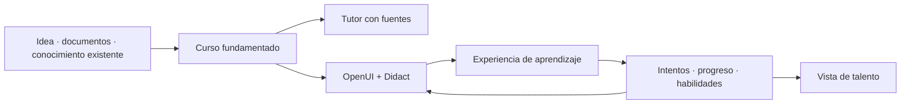

<p align="center">
  
</p>

<h1 align="center">SkillNet</h1>

<p align="center">
  <strong>SkillNet convierte una idea o un material en un curso cuyas explicaciones, actividades e interfaz pueden adaptarse a cada persona.</strong>
</p>

<p align="center">
  <a href="https://github.com/ANFAIA/SkillNet/actions/workflows/ci.yml"></a>
  <a href="LICENSE"></a>
</p>

<p align="center">
  <a href="https://skillnet.es">Web</a> ·
  <a href="https://skillnet.es/docs/">Documentación</a> ·
  <a href="RUNNING.md">Arranque rápido</a> ·
  <a href="https://github.com/ANFAIA/SkillNet">GitHub</a>
</p>

<p align="center">
  <a href="README.md">English</a> · <strong>Español</strong>
</p>

SkillNet es un sistema de código abierto que convierte conocimiento en formación capaz de cambiar de
forma para la persona que aprende. Puede funcionar como espacio compartido de una organización o una
clase, o como espacio de aprendizaje individual. Es autoalojado y se distribuye con licencia Apache
2.0.

**[Empieza aquí: ejecutar SkillNet en local →](RUNNING.md)**

## Por qué existe SkillNet

En muchas organizaciones pequeñas y medianas, formar depende de las personas que ya saben cómo
funciona todo. Cada incorporación obliga a alguien a detener su trabajo para volver a explicar los
mismos procesos. Puede existir documentación, pero rara vez constituye una experiencia completa de
aprendizaje, y la organización apenas tiene trazabilidad sobre quién sabe qué, dónde están los gaps o
quién podría ayudar a otra persona.

SkillNet crea otro canal para ese conocimiento. Convierte una idea o un material existente en un
curso estructurado, un tutor fundamentado en las mismas fuentes, actividades de aprendizaje y un
registro de progreso y habilidades.

## Una fuente, un recorrido completo de aprendizaje

Puedes describir lo que quieres enseñar o subir material en PDF, DOCX, Markdown o TXT. El material
subido sigue siendo la fuente que fundamenta el curso. Cuando se parte de una idea, SkillNet registra
la fuente generada y su procedencia antes de construirlo.

```text
idea o material de origen
        → conocimiento fundamentado del curso
        → estructura, lecciones y ejercicios
        → tutor y medios de aprendizaje
        → intentos, progreso y habilidades
```

El tutor responde desde el material del curso en lugar de comportarse como un chatbot genérico. La
superficie de aprendizaje puede combinar texto con ejemplos resueltos, diagramas, tarjetas,
actividades prácticas, audio y medios generados cuando está configurado el proveedor correspondiente.

## El mismo conocimiento, un camino distinto

SkillNet separa lo que debe permanecer estable de lo que puede cambiar para quien aprende:

| Contrato estable | Experiencia adaptable |
| --- | --- |
| conocimiento, objetivos, evidencias y criterios de evaluación | explicación, ejemplo, actividad, apoyo, medio e interfaz |

Un curso dinámico puede usar el puesto, las preferencias declaradas, la intención del momento, el
nivel, los intentos y el progreso para escoger una experiencia más adecuada. Esas señales son
evidencias revisables, no «estilos de aprendizaje» fijos ni una afirmación de que el sistema ya
conoce perfectamente a la persona.

La diferencia importa: responder a lo que alguien pide ahora no es lo mismo que conocer qué le ha
ayudado a lo largo del tiempo. SkillNet mantiene separadas ambas cosas para que el contexto inmediato
dé forma a la pantalla actual y la evidencia acumulada pueda sostener una personalización más
profunda.

## Cómo funciona



[OpenUI](https://github.com/thesysdev/openui) permite al modelo describir una interfaz mediante un
lenguaje controlado en lugar de inventar la aplicación desde cero. [Didact](https://github.com/JoseEstevez520/Didact)
aporta los componentes educativos que SkillNet puede componer. La mayoría de experiencias deben ser
rápidas, predecibles y basadas en componentes; la generación más abierta se reserva para los casos en
los que el catálogo controlado no puede expresar la tarea de aprendizaje.

## Qué está disponible ahora

- Crear un curso desde un tema o desde material en PDF, DOCX, Markdown o TXT.
- Generar estructura, lecciones fundamentadas, ejercicios y práctica.
- Servir cursos estáticos y activar individualmente el camino dinámico.
- Preguntar mediante un tutor fundamentado en las fuentes del curso.
- Componer pantallas de aprendizaje con OpenUI y el catálogo de Didact.
- Generar y adjuntar artefactos compatibles como podcasts e infografías.
- Registrar matrículas, intentos, progreso, dominio y habilidades.
- Explorar personas, cursos y habilidades registradas desde las superficies de talento.
- Elegir espacio de organización o individual en la primera configuración.
- Crear cursos y consultar habilidades desde la interfaz, la API REST externa, A2A o MCP.
- Ejecutar el sistema en local o autoalojarlo con Docker y un proveedor compatible con OpenAI.

## Qué sigue en validación

El runtime ya puede producir experiencias distintas desde un mismo curso, pero todavía necesitan
evidencia la eficacia educativa, la calidad de cada adaptación y el equilibrio entre intención
inmediata y memoria a largo plazo. La adaptación proactiva, la sincronización automática cuando
cambian las fuentes y las interfaces completamente abiertas son direcciones posteriores, no promesas
actuales.

## Ecosistema

SkillNet es el proyecto principal. Los repositorios de alrededor exploran partes de la misma
dirección:

- [Didact](https://github.com/JoseEstevez520/Didact) — los componentes educativos que usa SkillNet.
- [OpenUI](https://github.com/thesysdev/openui) — la capa actual de interfaz generada.
- [mcp-md-reader](https://github.com/JoseEstevez520/mcp-md-reader) — lectura estructural de Markdown para flujos con agentes.
- [SkillNet MCP](packages/skillnet-mcp/) — usar SkillNet desde chats y agentes compatibles con MCP.
- [A2TL-Web](https://github.com/JoseEstevez520/a2tl-web) — investigación anterior sobre interfaces generadas compactas.
- [A2TL-Video](https://github.com/JoseEstevez520/a2tl-video) — trabajo relacionado para vídeo generado por agentes.
- [Curio](https://github.com/JoseEstevez520/curio) — investigación sobre lectura y explicación en contexto.
- [DBP](https://github.com/JoseEstevez520/DBP) — trabajo relacionado sobre fronteras de datos entre agentes.

Son proyectos relacionados a distintos niveles. No todos son dependencias de lo que SkillNet
ejecuta hoy.

## Empieza aquí

La [guía de arranque](RUNNING.md) completa cubre la instalación, los datos de demostración, la
configuración, el modo con fixtures sin clave y la resolución de problemas.

```bash
cp .env.example .env                      # pon los dos secretos y elige API, modelo local o fixtures
docker compose up -d --build
docker compose exec api python -m src.seed_learning_demo   # opcional: carga la demo publica
```

Después abre <http://localhost:3000>. El repositorio incluye además un modo con fixtures y sin clave
para experimentar en local; las opciones están en [`RUNNING.md`](RUNNING.md).

## Explorar el proyecto

- [`docs/ROADMAP.md`](docs/ROADMAP.md) — base actual, prioridades activas y horizontes posteriores.
- [`docs/releases/2026-09-01-anfaia.md`](docs/releases/2026-09-01-anfaia.md) — snapshot de producto de ANFAIA que fija esta versión.
- [`docs/design/vision.md`](docs/design/vision.md) — las ideas detrás del producto.
- [`docs/design/product.md`](docs/design/product.md) — alcance actual y dirección de producto.
- [`docs/design/openui-adoption.md`](docs/design/openui-adoption.md) — cómo se evalúan e integran las interfaces generadas.
- [`docs/design/didact-integration.md`](docs/design/didact-integration.md) — cómo entran los componentes de Didact en SkillNet.
- [`docs/research/generative-ui/`](docs/research/generative-ui/) — experimentos con interfaces generadas.
- [`docs/research/post-markdown/`](docs/research/post-markdown/) — cómo leen los agentes la documentación existente.

## Contribuir

[`CONTRIBUTING.md`](CONTRIBUTING.md) cubre la preparación del entorno, las comprobaciones que corre
CI y las convenciones de [`AGENTS.md`](AGENTS.md). Los problemas de seguridad van por
[`SECURITY.md`](SECURITY.md), nunca por una incidencia pública.

> La documentación de desarrollo (`AGENTS.md`, `CONTRIBUTING.md`, `RUNNING.md` y `docs/`) está en
> inglés, que es el idioma de trabajo del repositorio. Este README es la puerta de entrada en
> español; si al leerlo echas en falta algo traducido, abre una incidencia y se traduce.

## Licencia

Se distribuye con licencia [Apache 2.0](LICENSE).
