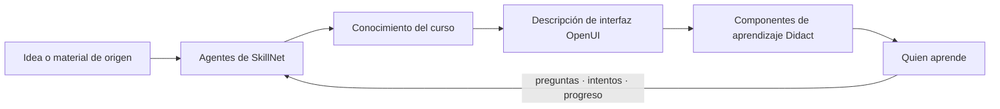

<p align="center">
  
</p>

<h1 align="center">SkillNet</h1>

<p align="center">
  <strong>SkillNet convierte una idea o un material en un curso cuyas explicaciones, actividades e interfaz pueden adaptarse a cada persona.</strong>
</p>

<p align="center">
  <a href="https://github.com/ANFAIA/SkillNet/actions/workflows/ci.yml"></a>
  <a href="LICENSE"></a>
</p>

<p align="center">
  <a href="https://skillnet.es">Web</a> ·
  <a href="https://skillnet.es/docs/">Documentación</a> ·
  <a href="RUNNING.md">Arranque rápido</a> ·
  <a href="https://github.com/ANFAIA/SkillNet">GitHub</a>
</p>

<p align="center">
  <a href="README.md">English</a> · <strong>Español</strong>
</p>

SkillNet es un sistema de aprendizaje adaptativo de código abierto. Se empieza por un tema o por
material que ya existe, y construye un curso estructurado capaz de presentar el mismo conocimiento
de forma distinta a cada persona.

Puede funcionar como espacio compartido de una organización o una clase, o como espacio de
aprendizaje individual. Es autoalojado y se distribuye con licencia Apache 2.0.

**[Empieza aquí: ejecutar SkillNet en local →](RUNNING.md)**

## De ideas y materiales a cursos

Puedes empezar describiendo lo que quieres enseñar o aprender, o subiendo el material que ya
contiene ese conocimiento. SkillNet lo convierte en un curso. El material que subes sigue siendo la
fuente que lo fundamenta; cuando partes de una idea, SkillNet crea una fuente generada, registra esa
procedencia y construye el curso a partir de ella.

SkillNet construye ese camino:

```text
idea o material de origen
        → conocimiento estructurado del curso
        → generación del curso y de las lecciones
        → ejercicios, explicaciones y práctica
        → una experiencia de aprendizaje para cada persona
```

El resultado no se limita a una única presentación fija. El mismo curso puede admitir distintas
explicaciones, actividades, medios e interfaces conservando su conocimiento y sus objetivos.

## El mismo conocimiento y objetivo, otra experiencia

El conocimiento y los objetivos pueden mantenerse estables mientras cambia lo que los rodea para la
persona que aprende:

| Lo que se mantiene estable | Lo que puede cambiar |
| --- | --- |
| conocimiento, objetivos, evidencias y criterios | explicación, ejemplo, actividad, apoyo e interfaz |

En un curso dinámico, el conocimiento y los objetivos compartidos se mantienen estables mientras la
explicación, la actividad, el apoyo y la interfaz pueden adaptarse usando las preferencias
declaradas de quien aprende, su puesto, su nivel y su progreso. Esas señales dan forma a la
experiencia sin tratarse como estilos de aprendizaje fijos.

## Cómo funciona



SkillNet combina una capa de conocimiento, agentes especializados y superficies de aprendizaje. El
camino actual de interfaz generada usa [OpenUI](https://github.com/thesysdev/openui).
[Didact](https://github.com/JoseEstevez520/Didact) aporta los componentes educativos: tarjetas,
ejemplos resueltos, diagramas, actividades de práctica y otras interacciones pensadas para aprender.

## Qué hay disponible

- Crear un curso desde un tema o desde material en PDF, DOCX, Markdown o TXT.
- Generar su estructura, sus lecciones y sus ejercicios.
- Admitir cursos por el camino estático y por el dinámico.
- Preguntar con las respuestas fundamentadas en el material del curso.
- Registrar la actividad de aprendizaje, los intentos y el progreso.
- Elegir espacio de organización o individual en la primera configuración.
- Crear un curso completo desde la interfaz, la API externa, el servicio A2A o el servidor MCP.
- Ejecutar el sistema en local o autoalojarlo con Docker.

El proyecto sigue en desarrollo. Algunas direcciones adaptativas están documentadas y en pruebas,
pero no deben leerse como promesas sobre resultados de aprendizaje ni como una afirmación de que el
sistema ya sabe cómo aprende cada persona.

## Ecosistema

SkillNet es el proyecto principal. Los repositorios de alrededor exploran partes de la misma
dirección:

- [Didact](https://github.com/JoseEstevez520/Didact) — los componentes educativos que usa SkillNet.
- [OpenUI](https://github.com/thesysdev/openui) — la capa actual de interfaz generada.
- [mcp-md-reader](https://github.com/JoseEstevez520/mcp-md-reader) — lectura estructural de Markdown para flujos con agentes.
- [SkillNet MCP](packages/skillnet-mcp/) — usar SkillNet desde chats y agentes compatibles con MCP.
- [A2TL-Web](https://github.com/JoseEstevez520/a2tl-web) — investigación anterior sobre interfaces generadas compactas.
- [A2TL-Video](https://github.com/JoseEstevez520/a2tl-video) — trabajo relacionado para vídeo generado por agentes.
- [Curio](https://github.com/JoseEstevez520/curio) — investigación sobre lectura y explicación en contexto.
- [DBP](https://github.com/JoseEstevez520/DBP) — trabajo relacionado sobre fronteras de datos entre agentes.

Son proyectos relacionados a distintos niveles. No todos son dependencias de lo que SkillNet
ejecuta hoy.

## Empieza aquí

La [guía de arranque](RUNNING.md) completa cubre la instalación, los datos de demostración, la
configuración, el modo con fixtures sin clave y la resolución de problemas.

```bash
cp .env.example .env                      # pon los dos secretos y elige API, modelo local o fixtures
docker compose up -d --build
docker compose exec api python -m src.seed_learning_demo   # opcional: carga la demo publica
```

Después abre <http://localhost:3000>. El repositorio incluye además un modo con fixtures y sin clave
para experimentar en local; las opciones están en [`RUNNING.md`](RUNNING.md).

## Explorar el proyecto

- [`docs/design/vision.md`](docs/design/vision.md) — las ideas detrás del producto.
- [`docs/design/product.md`](docs/design/product.md) — alcance actual y dirección de producto.
- [`docs/design/openui-adoption.md`](docs/design/openui-adoption.md) — cómo se evalúan e integran las interfaces generadas.
- [`docs/design/didact-integration.md`](docs/design/didact-integration.md) — cómo entran los componentes de Didact en SkillNet.
- [`docs/research/generative-ui/`](docs/research/generative-ui/) — experimentos con interfaces generadas.
- [`docs/research/post-markdown/`](docs/research/post-markdown/) — cómo leen los agentes la documentación existente.

## Contribuir

[`CONTRIBUTING.md`](CONTRIBUTING.md) cubre la preparación del entorno, las comprobaciones que corre
CI y las convenciones de [`AGENTS.md`](AGENTS.md). Los problemas de seguridad van por
[`SECURITY.md`](SECURITY.md), nunca por una incidencia pública.

> La documentación de desarrollo (`AGENTS.md`, `CONTRIBUTING.md`, `RUNNING.md` y `docs/`) está en
> inglés, que es el idioma de trabajo del repositorio. Este README es la puerta de entrada en
> español; si al leerlo echas en falta algo traducido, abre una incidencia y se traduce.

## Licencia

Se distribuye con licencia [Apache 2.0](LICENSE).
