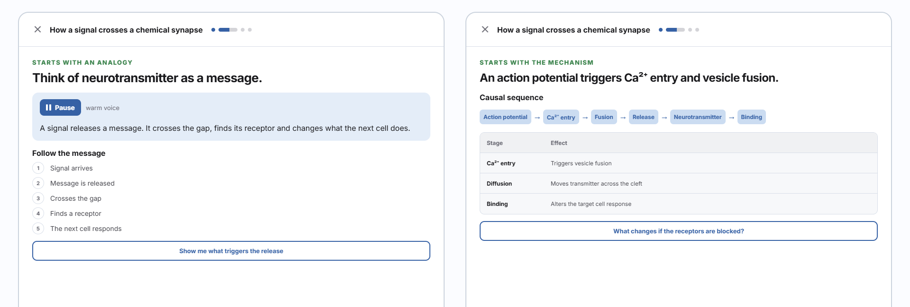

<p align="center">
  
</p>

<h1 align="center">Experiencias de aprendizaje generadas al momento</h1>

<p align="center">
  <strong>SkillNet convierte una idea o fuente en un curso, un tutor fundamentado y una interfaz de aprendizaje adaptativa.</strong>
</p>

<p align="center">
  Para una persona, una clase, un equipo o una organización.
</p>

<p align="center">
  <a href="https://skillnet.es"><strong>Web</strong></a> ·
  <a href="https://skillnet.es/docs/">Documentación</a> ·
  <a href="RUNNING.md">Ejecutar en local</a> ·
  <a href="README.md">English</a>
</p>

<p align="center">
  <a href="https://github.com/ANFAIA/SkillNet/actions/workflows/ci.yml"></a>
  <a href="LICENSE"></a>
</p>

<p align="center">
  
</p>

## Empieza con una idea o aporta tus fuentes

El aprendizaje no siempre comienza dentro de una organización ni en un documento existente. A veces
empieza con un tema que quieres comprender. Otras veces, el conocimiento ya vive en PDF, manuales,
notas o conversaciones.

SkillNet admite ambos caminos. Describe lo que quieres aprender o enseñar, o sube material PDF,
DOCX, Markdown y TXT. A partir de ahí construye un curso estructurado con lecciones, ejercicios,
tutor y medios de aprendizaje. El material subido permanece como fuente fundamentadora; los cursos
que nacen de una idea conservan la procedencia generada por el modelo y no la presentan como
evidencia aportada.

## Una base, distintas formas de aprender

El conocimiento, los objetivos y los criterios de evaluación permanecen estables. La explicación,
el ejemplo, la actividad, el medio y la interfaz pueden cambiar según las preferencias, experiencia,
estado actual y señales de interacción acotadas de quien aprende.

| El contrato de aprendizaje | La experiencia puede adaptarse |
| --- | --- |
| Conocimiento y fuentes | Explicaciones y ejemplos |
| Objetivos y evidencias | Práctica y apoyo |
| Criterios de evaluación | Medio, secuencia e interfaz |

Responder a una petición del momento no es lo mismo que aprender qué le ha ayudado a una persona a
lo largo del tiempo. SkillNet trata esas señales como evidencia revisable, no como «estilos de
aprendizaje» fijos ni como afirmación de que el sistema ya conoce perfectamente a la persona.

## Qué hace SkillNet hoy

- **Crea cursos completos** desde un tema o fuentes PDF, DOCX, Markdown y TXT.
- **Responde mediante un tutor del curso** que recupera las fuentes matriculadas y devuelve
  procedencia.
- **Compone experiencias de aprendizaje** con [OpenUI](https://github.com/thesysdev/openui) y un
  subconjunto compatible y versionado de [Didact](https://github.com/JoseEstevez520/Didact).
- **Genera medios educativos** como podcasts, infografías, presentaciones y vídeos narrados cuando
  están configurados los proveedores correspondientes.
- **Registra progreso y habilidades** mediante matrículas, intentos, dominio y verificación
  explícita.
- **Funciona a distintas escalas** con espacios individuales y de organización: desde estudio
  personal hasta clases, equipos y despliegues mayores.
- **Se conecta con otras herramientas** mediante su API REST y adaptadores opcionales A2A y MCP.
- **Se ejecuta en tu infraestructura** con Docker y un proveedor compatible con OpenAI.

## Ejecutar en local

```bash
cp .env.example .env
docker compose up -d --build
docker compose exec api python -m src.seed_learning_demo   # demo pública opcional
```

Abre <http://localhost:3000>. La [guía de arranque](RUNNING.md) explica la configuración de
proveedores, los fixtures sin clave, los datos de demostración y la resolución de problemas.

## Explorar

- [Visión](docs/design/vision.md): por qué el software de aprendizaje debería adaptarse a las personas.
- [Producto](docs/design/product.md): alcance actual y dirección del producto.
- [Roadmap](docs/ROADMAP.md): las cuatro prioridades siguientes.
- [Snapshot ANFAIA](docs/releases/2026-09-01-anfaia.md): qué contiene esta versión.
- [Adopción de OpenUI](docs/design/openui-adoption.md): el runtime GenUI controlado.
- [Integración de Didact](docs/design/didact-integration.md): cómo entran los componentes educativos.
- [Contribuir](CONTRIBUTING.md): entorno de desarrollo, comprobaciones y convenciones.

## Ecosistema

SkillNet es el proyecto principal. [Didact](https://github.com/JoseEstevez520/Didact),
[OpenUI](https://github.com/thesysdev/openui),
[mcp-md-reader](https://github.com/JoseEstevez520/mcp-md-reader),
[A2TL-Web](https://github.com/JoseEstevez520/a2tl-web),
[A2TL-Video](https://github.com/JoseEstevez520/a2tl-video),
[Curio](https://github.com/JoseEstevez520/curio) y
[DBP](https://github.com/JoseEstevez520/DBP) exploran a distintos niveles partes relacionadas de la
misma dirección; no todos son dependencias del runtime actual.

## Licencia

SkillNet es open source bajo la [licencia Apache 2.0](LICENSE). Los problemas de seguridad deben
seguir [SECURITY.md](SECURITY.md), nunca una incidencia pública.
