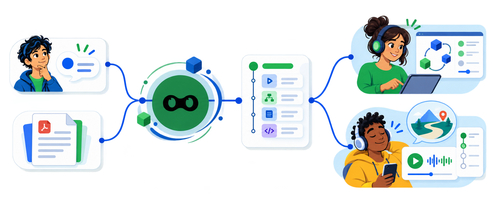
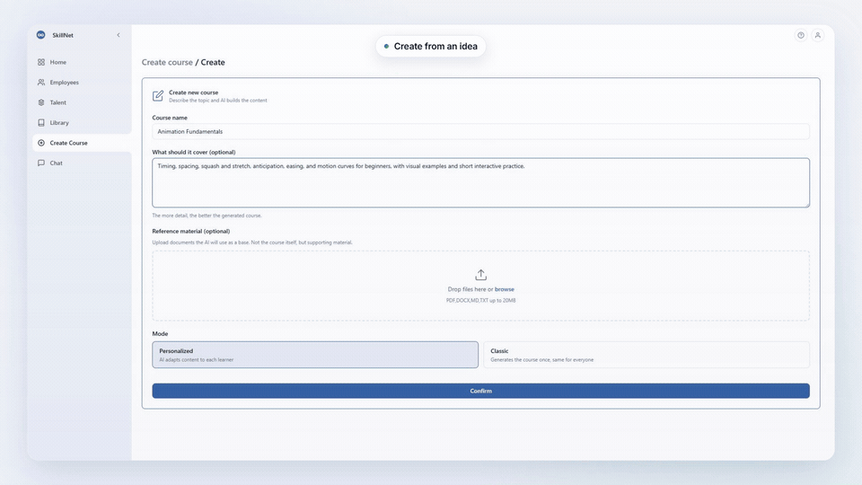

<p align="center">
  
</p>

<h1 align="center">Learning does not have to be the same for everyone</h1>

<p align="center">
  <strong>SkillNet turns what you want to teach into courses, grounded tutors, learning materials and adaptive interfaces.</strong>
</p>

<p align="center">
  For one learner, a class, a team or an organization.
</p>

<p align="center">
  <a href="https://skillnet.es"></a>
  <a href="https://skillnet.es/docs/"></a>
  <a href="LICENSE"></a>
</p>

<p align="center">
  <a href="RUNNING.md">Run locally</a> ·
  <a href="README.es.md">Español</a>
</p>

<p align="center">
  
</p>

## What is SkillNet?

Learning does not always begin inside an organization or an existing document. Sometimes it starts
with a topic you want to understand. Sometimes the knowledge already lives in PDFs, manuals, notes
or conversations.

SkillNet supports both paths. Describe what you want to learn or teach, or upload PDF, DOCX,
Markdown and TXT material. It then builds a structured course with lessons, exercises, a tutor and
learning media. Uploaded material remains the grounding source. Courses that begin from an idea
preserve the provenance of their generated source instead of presenting it as uploaded evidence.

## How it works

The knowledge, objectives and evaluation criteria stay stable. The explanation, example, activity,
medium and interface can change with the learner's preferences, experience, current state and
bounded interaction signals.

| The learning contract | The experience can adapt |
| --- | --- |
| Knowledge and sources | Explanations and examples |
| Objectives and evidence | Practice and support |
| Evaluation criteria | Medium, sequence and interface |

Responding to a request in the moment is not the same as learning what has helped a person over
time. SkillNet treats those signals as revisable evidence, not fixed “learning styles” and not a
claim that the system already knows the learner perfectly.

## What you can do today

- **Creates complete courses** from a topic or PDF, DOCX, Markdown and TXT sources.
- **Answers with a course tutor** that retrieves enrolled sources and returns provenance.
- **Composes learning experiences** with [OpenUI](https://github.com/thesysdev/openui) and a
  supported subset of [Didact](https://github.com/JoseEstevez520/Didact) with a pinned version.
- **Generates learning media** such as podcasts, infographics, slide decks and narrated videos when
  the corresponding providers are configured.
- **Records progress and skills** through enrollments, attempts, mastery and explicit verification.
- **Works at different scales** through individual and organization workspaces, from personal study
  to classes, teams and larger deployments.
- **Connects to other tools** through its REST API and optional A2A and MCP adapters.
- **Runs on your infrastructure** with Docker and an OpenAI-compatible model provider.

<h2 align="center">See SkillNet in action</h2>

<p align="center">
  <a href="assets/readme/skillnet-product-demo-en.mp4"></a>
</p>

Try SkillNet in the [live demo](https://demo.skillnet.es/entrar?lang=en),
[run it locally](RUNNING.md) or [read the documentation](https://skillnet.es/docs/).

## Run it locally

```bash
cp .env.example .env
docker compose up -d --build
docker compose exec api python -m src.seed_learning_demo   # optional public demo
```

Open <http://localhost:3000>. The full [running guide](RUNNING.md) covers provider configuration,
keyless fixtures, demo data and troubleshooting.

## Documentation

- [Vision](docs/design/vision.md): why learning software should adapt to people.
- [Product](docs/design/product.md): current scope and product direction.
- [Roadmap](docs/ROADMAP.md): the next four priorities.
- [ANFAIA release snapshot](docs/releases/2026-09-01-anfaia.md): what this version contains.
- [OpenUI adoption](docs/design/openui-adoption.md): the controlled GenUI runtime.
- [Didact integration](docs/design/didact-integration.md): how learning components enter SkillNet.
- [Contributing](CONTRIBUTING.md): development setup, checks and conventions.

## Ecosystem

SkillNet is the main project. [Didact](https://github.com/JoseEstevez520/Didact),
[OpenUI](https://github.com/thesysdev/openui),
[mcp-md-reader](https://github.com/JoseEstevez520/mcp-md-reader),
[A2TL-Web](https://github.com/JoseEstevez520/a2tl-web),
[A2TL-Video](https://github.com/JoseEstevez520/a2tl-video),
[Curio](https://github.com/JoseEstevez520/curio) and
[DBP](https://github.com/JoseEstevez520/DBP) explore related parts of the same direction at different
levels; they are not all dependencies of the current runtime.

## License

SkillNet is open source under the [Apache 2.0 license](LICENSE). Security issues should follow
[SECURITY.md](SECURITY.md), never a public issue.
