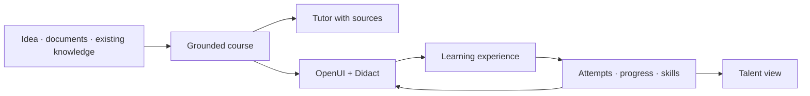

<p align="center">
  
</p>

<h1 align="center">SkillNet</h1>

<p align="center">
  <strong>SkillNet turns an idea or source into a course whose explanations, activities and interface can change with the learner's profile and state.</strong>
</p>

<p align="center">
  <a href="https://github.com/ANFAIA/SkillNet/actions/workflows/ci.yml"></a>
  <a href="LICENSE"></a>
</p>

<p align="center">
  <a href="https://skillnet.es">Website</a> ·
  <a href="https://skillnet.es/docs/">Documentation</a> ·
  <a href="RUNNING.md">Quick start</a> ·
  <a href="https://github.com/ANFAIA/SkillNet">GitHub</a>
</p>

<p align="center">
  <strong>English</strong> · <a href="README.es.md">Español</a>
</p>

SkillNet is an open-source system for turning knowledge into training that can change shape for the
person learning. It can run as a shared organization workspace, which can be used by a team or
class, or as an individual learning workspace. It is self-hosted and licensed under Apache 2.0.

**[Start here: run SkillNet locally →](RUNNING.md)**

## Why SkillNet exists

In many small and medium organizations, training depends on the people who already know how things
work. Every new hire makes someone stop their regular work to explain the same processes again.
Documentation may exist, but it is rarely a complete learning experience, and the organization has
little traceability over who knows what, where the gaps are, or who could help someone else.

SkillNet creates another channel for that knowledge. It turns an idea or existing source material
into a structured course, a course-scoped tutor that can retrieve from those sources, learning
activities and a record of progress and skills.

## One source, a complete learning path

You can describe what you want to teach or upload PDF, DOCX, Markdown or TXT material. Uploaded
material remains the grounding source. When a course starts from an idea, SkillNet records a
clearly marked model-generated source and its provenance before building the course. That path is
not equivalent to grounding in uploaded organization material.

```text
idea or source material
        → grounded course knowledge
        → structure, lessons and exercises
        → tutor and learning media
        → attempts, progress and skills
```

For course- or source-specific questions, the tutor retrieves from enrolled material and returns
provenance. General questions can be answered in general mode without course citations. The
learning surface can combine text with components such as worked examples, diagrams, flashcards,
practice activities, audio and generated media when the corresponding provider is configured.

## The same knowledge, a different path

SkillNet separates what must remain stable from what can change for the learner:

| Stable contract | Adaptive experience |
| --- | --- |
| knowledge, objectives, evidence and evaluation criteria | explanation, example, activity, support, medium and interface |

A validated dynamic course can use the learner's role, declared preferences, experience level,
current node state and bounded longitudinal interaction signals to choose an experience. Learners
with equivalent inputs may share a render. These signals are revisable evidence, not fixed
"learning styles" and not a claim that the system already knows the person perfectly.

This distinction matters: responding to what someone asks now is not the same as knowing what has
helped them over time. Editable learner memory currently personalizes the tutor. Lesson generation
uses declared preferences, learner state and bounded event projections; using free-form memory to
steer shared lesson renders remains future work.

## How it works



[OpenUI](https://github.com/thesysdev/openui) lets the model describe an interface through a
controlled language instead of inventing the application from scratch. [Didact](https://github.com/JoseEstevez520/Didact)
provides the educational components that SkillNet can compose. The current runtime uses a supported,
version-pinned subset of Didact. Open-ended interface generation remains research.

## What is available now

- Create a course from a topic or from PDF, DOCX, Markdown or TXT material.
- Generate a course structure, grounded lessons, exercises and practice.
- Deliver static courses and opt individual courses into the dynamic path.
- Review and validate dynamic course schemas before learner delivery.
- Ask course-specific questions through a tutor that retrieves sources and returns provenance.
- Compose learning screens with OpenUI and a supported subset of the Didact catalog.
- Generate podcasts, infographics, slide decks and narrated slide videos asynchronously when the
  required AI, image and TTS providers are configured.
- Record enrollments, attempts, progress and mastery, plus skill levels from course mastery or
  explicit verification.
- Explore people, courses and recorded skills through the talent surfaces.
- Choose an organization or individual workspace at first setup.
- Create courses and query skills through the UI and external REST API; optional A2A and MCP
  adapters use the same API and start through their Compose profiles.
- Run locally or self-host with Docker and an OpenAI-compatible model provider.

## What is still being validated

The controlled runtime can already produce different experiences for different learner profiles
and states, but educational effectiveness and the quality of each adaptation still need evidence.
Using free-form learner memory in lesson generation, proactive adaptation, automatic synchronization
with changed sources and fully open-ended generated interfaces remain later directions, not current
promises.

## Ecosystem

SkillNet is the main project. The surrounding repositories explore parts of the same direction:

- [Didact](https://github.com/JoseEstevez520/Didact) — educational components used by SkillNet.
- [OpenUI](https://github.com/thesysdev/openui) — the current generated-interface layer.
- [mcp-md-reader](https://github.com/JoseEstevez520/mcp-md-reader) — structural Markdown reading for agent workflows.
- [SkillNet MCP](packages/skillnet-mcp/) — use SkillNet from MCP-compatible chats and agents.
- [A2TL-Web](https://github.com/JoseEstevez520/a2tl-web) — earlier research into compact generated interfaces.
- [A2TL-Video](https://github.com/JoseEstevez520/a2tl-video) — related work for agent-generated video.
- [Curio](https://github.com/JoseEstevez520/curio) — contextual reading and explanation research.
- [DBP](https://github.com/JoseEstevez520/DBP) — related work on data boundaries between agents.

These projects are related at different levels. They are not all dependencies of the current
SkillNet runtime.

## Start here

The complete [running guide](RUNNING.md) covers setup, demo data, configuration, keyless fixtures
and troubleshooting.

```bash
cp .env.example .env                      # set the two secrets, then choose API, local model or fixtures
docker compose up -d --build
docker compose exec api python -m src.seed_learning_demo   # optional: loads the public demo
```

Then open <http://localhost:3000>. The repository also includes a keyless fixture mode for local
experiments; see [`RUNNING.md`](RUNNING.md) for the available options.

## Explore the project

- [`docs/ROADMAP.md`](docs/ROADMAP.md) — current baseline, active priorities and later horizons.
- [`docs/releases/2026-09-01-anfaia.md`](docs/releases/2026-09-01-anfaia.md) — the ANFAIA product snapshot behind this version.
- [`docs/design/vision.md`](docs/design/vision.md) — the ideas behind the product.
- [`docs/design/product.md`](docs/design/product.md) — current scope and product direction.
- [`docs/design/openui-adoption.md`](docs/design/openui-adoption.md) — how generated interfaces are evaluated and integrated.
- [`docs/design/didact-integration.md`](docs/design/didact-integration.md) — how Didact components enter SkillNet.
- [`docs/research/generative-ui/`](docs/research/generative-ui/) — experiments with generated interfaces.
- [`docs/research/post-markdown/`](docs/research/post-markdown/) — how agents read existing documentation.

## Contributing

[`CONTRIBUTING.md`](CONTRIBUTING.md) covers the development setup, the checks CI runs, and the
conventions in [`AGENTS.md`](AGENTS.md). Security issues go through
[`SECURITY.md`](SECURITY.md), never a public issue.

## License

Distributed under the [Apache 2.0](LICENSE) license.
