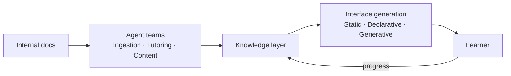

<p align="center">
  
  <h1 align="center">SkillNet</h1>
  <p align="center">
    <strong>Intelligent system for organizational knowledge evolution and talent development</strong>
  </p>
  <p align="center">
    <a href="https://anfaia.org"></a>
    <a href="https://skillnet-docs.vercel.app/"></a>
    
    
    
  </p>
</p>

---

> SkillNet transforms an organization's knowledge into a living intelligence system that trains, evaluates and develops talent continuously, adaptively and equitably.

## The problem

In many SMEs, critical knowledge is passed on informally, depends on specific individuals and is neither structured nor accessible. Onboarding new hires falls on the most experienced workers, who have to balance their daily workload with training, without the right tools or enough time to do it properly.

The result: **overloaded professionals** repeating the same onboarding processes over and over, directly limiting the company's ability to grow.

## The idea

Moving from static documents to a **living knowledge system**.

A system that doesn't just store information, but understands it, teaches it, adapts it and evolves with the people.

SkillNet takes a company's internal knowledge · manuals, processes, documentation · and turns it into a learning ecosystem: it automatically generates courses, handbooks, exercises and other training formats, guides users through AI agents and tracks their progress to deliver a personalized experience.

## What sets it apart

- **Living knowledge** · The system learns from usage, improves content and evolves with the company
- **Adaptive** · Content and pace tailored to each individual
- **Accessible** · Designed for any user profile, including neurodiversity

## How it works



## What's being explored

The project is in its research phase. These are the areas currently under investigation and how they connect to SkillNet:

| Area | Why it matters for SkillNet | Status |
|------|----------------------------|--------|
| **[Semantic Boundaries](docs/research/semantic-boundaries/)** | How to control who accesses what knowledge in a multi-tenant training platform | Content-only classification hits a hard ceiling. Exploring structural access control. |
| **[Generative UI](docs/research/generative-ui/)** | Personalized training content needs interfaces generated on the fly for each learner | Built A2TL-Web for Level 2 generation. Exploring Level 3 and latency solutions. |
| **[Multi-Agent Coordination](docs/research/multi-agent-coordination/)** | A platform with multiple agents serving multiple users needs governance | Discovered mandate-based authority model. Defining protocols. |
| **[Post-Markdown](docs/research/post-markdown/)** | Agents need to consume documentation efficiently to generate training content | Built mcp-md-reader (90% token savings). Exploring what comes after Markdown. |

See [`docs/research/`](docs/research/) for detailed write-ups on each topic.

## Repository structure

```
skillnet/
├── docs/
│   ├── design/                    Architecture and technical decisions
│   └── research/                  Investigation by topic
├── apps/
│   ├── skillnet-api/              FastAPI backend — auth, CRUD, RAG, LangGraph generation, chat
│   └── skillnet-web/              React SPA frontend
├── docker/                        Dockerfiles + nginx config
├── docker-compose.yml             Production stack (db + api + web)
├── packages/
│   ├── a2tl-video/                A2TL-Video — compact spec for agent-generated video
│   ├── a2tl-web/                  A2TL-Web — compact spec for agent-generated web pages
│   └── mcp-md-reader/             Intelligent markdown reading for LLM agents
└── assets/
```

## Tech stack

<p>
  
  
  
  
  
  
</p>

| Layer | Technology |
|-------|------------|
| **Intelligence** | LLMs for generation and reasoning |
| **Knowledge** | RAG grounded in reliable internal knowledge |
| **Orchestration** | Specialized AI agents with modular architecture |
| **Infrastructure** | Self-hostable, no vendor lock-in |

## Quick start

**→ [`RUNNING.md`](RUNNING.md)**

Five steps and one decision: an API key, a local model, or neither. It covers what to put in
`.env`, how to load the demo data, how to verify it came up, and what each failure symptom
means.

The short version, if you already have an OpenAI key:

```bash
cp .env.example .env                                         # then set SECRET_KEY,
                                                             # POSTGRES_PASSWORD, LLM_API_KEY
docker compose up -d --build
docker compose exec api uv run python -m src.seed_demo_v2    # do not skip: creates the data
```

Then <http://localhost:3000>, as `admin@skillnet.dev` / `admin123`.

### Try Gen UI (dynamic courses)

Gen UI generates each learning screen on the fly, personalized for the learner.
Both static (v1) and dynamic (v2) courses are always available — the choice is per-course.

1. Run [step 4](#step-4--load-the-demo-data-recommended) if you have not already
2. Log in as any employee (password: `espiga2026`)
3. Go to **Mis Cursos** and open a dynamic course

The v2 seed creates a Spanish bakery-café organization: five employees (four with populated
learner profiles, one deliberately without — that is the one to walk the onboarding wizard
with), three source documents indexed for the tutor, and two validated dynamic courses of 3
and 7 nodes. Every employee shares the password `espiga2026`; the admin keeps whatever is in
your `.env`.

It is idempotent, so running it twice changes nothing. `--refresh` is the content-editing
loop: edit the node specs in `src/seed_demo_v2.py`, re-run with `--refresh`, and the
design-time fields of the existing nodes are overwritten in place while learner progress is
kept. It also bumps `courses.schema_version`, which is part of the render `cache_key`, so
cached renders are invalidated and the next visit regenerates.

### Dynamic courses (v2)

v2 generates each screen for each learner at the moment they open it, instead of serving one
static Markdown lesson to everybody. Both modes are always available — the choice is
per-course via `delivery_mode`. A course takes the v2 path only when it has
`delivery_mode='dynamic'` **and** `schema_status='validated'`; every other course stays on v1.

**No API key?** Put these two lines in your `.env` and start the stack normally:

```
LLM_MODEL=fixture/local
EMBEDDING_MODEL=fixture/local
```

Every LLM and embedding call is then served from the recordings in
`apps/skillnet-api/src/llm/fixture_data`, and the whole stack — SPA included — runs without
a single key. Two honest limits: only the screens with a recorded response render (the rest
raise a clear "fixture missing" error naming the key it wanted), and an `llm_model` saved in
the organization's settings takes priority over the environment, so a previously configured
organization keeps calling its provider.

There is also a `fixtures` profile, but it is **not** the keyless mode for the web app:

```bash
docker compose --profile fixtures up -d db api-fixtures   # http://127.0.0.1:8001
```

It publishes a second API for `curl` and Swagger. The SPA cannot use it, because
`docker/nginx.conf` proxies to `api` unconditionally with no variable to change. It also
shares `SECRET_KEY` and the database with the real API, so treat it as a debugging tool and
not as an isolated sandbox.

It runs the same image as `api` on its own port (`API_FIXTURES_PORT`, default `8001`),
because the bundled nginx SPA proxies to `api`. To run the *whole* stack keyless instead,
set `LLM_MODEL=fixture/local` and `EMBEDDING_MODEL=fixture/local` in `.env`.

Two optional knobs pick the models for the two-tier runtime router,
`LLM_RUNTIME_FAST_MODEL` and `LLM_RUNTIME_HEAVY_MODEL`. Leave both empty and every tier
falls back to `LLM_MODEL`, which works fine. Tuning generation quality is documented in
[`docs/design/tuning.md`](docs/design/tuning.md); the full design is in
[`docs/design/v2-dynamic-courses.md`](docs/design/v2-dynamic-courses.md).

## Services and ports

**A default `docker compose up -d` publishes exactly one port: 3000.** Everything else
talks over the internal compose network, so the API and the database are not reachable from
your machine, let alone from the network — which is the point.

| Service | Published | Reachable from | Description |
|---------|-----------|----------------|-------------|
| **web** | `3000` | anywhere on your network | SPA + nginx, the only front door |
| **api** | — | inside compose only | FastAPI, behind nginx |
| **db** | — | inside compose only | PostgreSQL + pgvector |
| **api-fixtures** *(profile `fixtures`)* | `127.0.0.1:8001` | this machine only | keyless API for `curl`, **not** used by the SPA |
| **a2a** *(profile `a2a`)* | `127.0.0.1:5000` | this machine only | agent-to-agent server; refuses to start without `A2A_AUTH_KEY` |
| **ollama** *(overlay file)* | `127.0.0.1:11434` | this machine only | local model server |

The development overlay adds two more, both bound to `127.0.0.1`: `8000` for the API
(bypassing nginx, so no security headers and no upload limit) and `5432` for Postgres.
Never change those to `0.0.0.0` on a shared network: Docker publishes ports with DNAT rules
that **bypass the host firewall**, so a firewall will not save you.

`web` on `3000` is deliberately open so other devices can reach the app. If you serve it
over plain HTTP beyond localhost, note that `COOKIE_SECURE` defaults to `false`, which means
session cookies travel unencrypted. Put it behind TLS and set `COOKIE_SECURE=true`.

### API documentation

Set `DEBUG=true` in your `.env` for Swagger at
[http://localhost:3000/api/docs](http://localhost:3000/api/docs).

A caveat worth knowing, because it bites more than `DEBUG`: **only the variables listed in
`docker-compose.yml` reach the container.** No service declares `env_file`, and
`.dockerignore` keeps `.env` out of the image, so anything you add to `.env` that the
compose file does not forward is silently ignored. That includes most of the tuning dials in
[`docs/design/tuning.md`](docs/design/tuning.md) — to use one, add it to the `environment:`
block of `api` first.

### Local development

```bash
# Backend (needs a reachable PostgreSQL+pgvector, e.g. `docker compose up -d db`)
cd apps/skillnet-api
uv sync
uv run uvicorn src.main:app --reload      # http://localhost:8000  (docs at /api/docs in DEBUG)
uv run pytest -m "not integration"        # unit tests — no database, no API key
uv run pytest -m integration              # integration suites — need a live PostgreSQL
uv run ruff check src tests

# Generation quality bench (see docs/design/tuning.md)
uv run python scripts/quality_bench.py --offline   # recorded fixtures, no API key

# Frontend (Vite dev server proxies /api to localhost:8000)
cd apps/skillnet-web
pnpm install
pnpm dev                                   # http://localhost:5173
```

### End-to-end flow

Admin uploads a document — creates a course from it — triggers generation (the
LangGraph pipeline extracts themes, designs structure, writes modules/lessons in
Markdown and exercises, self-reviews, and publishes a draft) — publishes the
course — invites an employee and assigns the course. The employee logs in, works
through the Markdown lessons and exercises, and asks the tutor chatbot questions
answered from the source material via RAG.

## Ethics

- **Data sovereignty** · User metrics are encrypted and belong to the employee and the organization, not to an external SaaS
- **Equal access** · Democratizing knowledge within organizations
- **Bias reduction** · Objective, data-driven assessment instead of perception-based evaluation
- **SDGs** · Aligned with SDG 4 (quality education) and SDG 8 (decent work)

## License

Distributed under the [Apache 2.0](LICENSE) license.

---

<p align="center">
  <em>Early-stage project. Architecture, stack and scope may evolve during development.</em>
  <br><br>
  Built as part of the <a href="https://anfaia.org">ANFAIA Summer Grants 2026</a>
</p>
