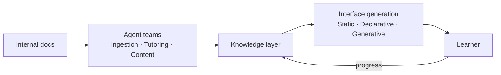

<p align="center">
  
  <h1 align="center">SkillNet</h1>
  <p align="center">
    <strong>Intelligent system for organizational knowledge evolution and talent development</strong>
  </p>
  <p align="center">
    <a href="https://skillnet.es"></a>
    <a href="https://anfaia.org"></a>
    <a href="https://skillnet-docs.vercel.app/"></a>
    
    
    
  </p>
</p>

---

> SkillNet transforms an organization's knowledge into a living intelligence system that trains, evaluates and develops talent continuously, adaptively and equitably.

## The problem

In many SMEs, critical knowledge is passed on informally, depends on specific individuals and is neither structured nor accessible. Onboarding new hires falls on the most experienced workers, who have to balance their daily workload with training, without the right tools or enough time to do it properly.

The result: **overloaded professionals** repeating the same onboarding processes over and over, directly limiting the company's ability to grow.

## The idea

Moving from static documents to a **living knowledge system**.

SkillNet takes a company's internal knowledge · manuals, processes, documentation · and turns it into a learning ecosystem: it automatically generates courses, handbooks, exercises and other training formats, guides users through AI agents and tracks their progress to deliver a personalized experience.

## What sets it apart

- **Living knowledge** · The system learns from usage, improves content and evolves with its users
- **Adaptive** · Content and pace tailored to each individual — including **Gen UI**: each lesson screen can be generated on the fly, personalized for the learner, rather than served as one static page for everybody. See [`docs/design/v2-dynamic-courses.md`](docs/design/v2-dynamic-courses.md)
- **Accessible** · Designed for any user profile, including neurodiversity
- **One product, two modes** · The same core serves an organization (company, team, class, academy) or a single individual who installs it for themselves — chosen at first boot, no forks. See [`docs/design/audience-modes.md`](docs/design/audience-modes.md)
- **Built on Didact** · Lessons are composed from [Didact](docs/design/didact-components.md), our own catalogue of accessible, interactive learning components (quizzes, flashcards, worked examples, diagrams) with explicit pedagogical contracts — not generic UI widgets repurposed for teaching.

## How it works



## Repository structure

```
skillnet/
├── docs/
│   ├── design/                    Architecture and technical decisions
│   └── research/                  Investigation by topic
├── apps/
│   ├── skillnet-api/              FastAPI backend — auth, CRUD, RAG, LangGraph generation, chat
│   └── skillnet-web/              React SPA frontend
├── docker/                        Dockerfiles + nginx config
├── docker-compose.yml             Production stack (db + api + web)
├── packages/
│   ├── a2tl-video/                A2TL-Video — compact spec for agent-generated video
│   ├── a2tl-web/                  A2TL-Web — compact spec for agent-generated web pages
│   └── mcp-md-reader/             Intelligent markdown reading for LLM agents
└── assets/
```

## Tech stack

<p>
  
  
  
  
  
  
</p>

| Layer | Technology |
|-------|------------|
| **Intelligence** | LLMs for generation and reasoning |
| **Knowledge** | RAG grounded in reliable internal knowledge |
| **Orchestration** | Specialized AI agents with modular architecture |
| **Infrastructure** | Self-hostable, no vendor lock-in |

## Quick start

**→ [`RUNNING.md`](RUNNING.md)** — five steps and one decision (an API key, a local model, or
neither), how to load the demo data, and what each failure symptom means. It also covers
running without any API key (`fixture/local`), the full port map, media/audio provider keys,
agent tools (a2a + external API), and local (non-Docker) development.

The short version, if you already have an OpenAI key:

```bash
cp .env.example .env                                         # then set SECRET_KEY,
                                                             # POSTGRES_PASSWORD, LLM_API_KEY
docker compose up -d --build
docker compose exec api uv run python -m src.seed_learning_demo   # optional: loads the public demo
```

Then <http://localhost:3000>, as `admin@skillnet.dev` / `admin123`. For your own install,
leave `ADMIN_EMAIL`/`ADMIN_PASSWORD` blank in `.env` and the first visit opens a `/setup`
wizard to pick the mode and create your owner account.

## Ethics

- **Data sovereignty** · User metrics are encrypted and belong to you or your organization, not to an external SaaS
- **Equal access** · Democratizing access to knowledge, inside organizations and beyond
- **Bias reduction** · Objective, data-driven assessment instead of perception-based evaluation
- **SDGs** · Aligned with SDG 4 (quality education) and SDG 8 (decent work)

## License

Distributed under the [Apache 2.0](LICENSE) license.

---

<p align="center">
  <em>Early-stage project. Architecture, stack and scope may evolve during development.</em>
  <br><br>
  Built as part of the <a href="https://anfaia.org">ANFAIA Summer Grants 2026</a>
</p>
