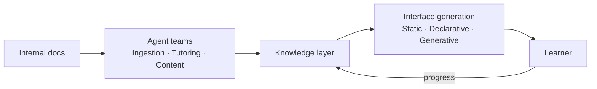

<p align="center">
  
  <h1 align="center">SkillNet</h1>
  <p align="center">
    <strong>Intelligent system for organizational knowledge evolution and talent development</strong>
  </p>
  <p align="center">
    <a href="https://anfaia.org"></a>
    <a href="https://skillnet-docs.vercel.app/"></a>
    
    
    
  </p>
</p>

---

> SkillNet transforms an organization's knowledge into a living intelligence system that trains, evaluates and develops talent continuously, adaptively and equitably.

## The problem

In many SMEs, critical knowledge is passed on informally, depends on specific individuals and is neither structured nor accessible. Onboarding new hires falls on the most experienced workers, who have to balance their daily workload with training, without the right tools or enough time to do it properly.

The result: **overloaded professionals** repeating the same onboarding processes over and over, directly limiting the company's ability to grow.

## The idea

Moving from static documents to a **living knowledge system**.

A system that doesn't just store information, but understands it, teaches it, adapts it and evolves with the people.

SkillNet takes a company's internal knowledge · manuals, processes, documentation · and turns it into a learning ecosystem: it automatically generates courses, handbooks, exercises and other training formats, guides users through AI agents and tracks their progress to deliver a personalized experience.

## What sets it apart

- **Living knowledge** · The system learns from usage, improves content and evolves with the company
- **Adaptive** · Content and pace tailored to each individual
- **Accessible** · Designed for any user profile, including neurodiversity

## How it works



## What's being explored

The project is in its research phase. These are the areas currently under investigation and how they connect to SkillNet:

| Area | Why it matters for SkillNet | Status |
|------|----------------------------|--------|
| **[Semantic Boundaries](docs/research/semantic-boundaries/)** | How to control who accesses what knowledge in a multi-tenant training platform | Content-only classification hits a hard ceiling. Exploring structural access control. |
| **[Generative UI](docs/research/generative-ui/)** | Personalized training content needs interfaces generated on the fly for each learner | Built A2TL-Web for Level 2 generation. Exploring Level 3 and latency solutions. |
| **[Multi-Agent Coordination](docs/research/multi-agent-coordination/)** | A platform with multiple agents serving multiple users needs governance | Discovered mandate-based authority model. Defining protocols. |
| **[Post-Markdown](docs/research/post-markdown/)** | Agents need to consume documentation efficiently to generate training content | Built mcp-md-reader (90% token savings). Exploring what comes after Markdown. |

See [`docs/research/`](docs/research/) for detailed write-ups on each topic.

## Repository structure

```
skillnet/
├── docs/
│   ├── design/                    Architecture and technical decisions
│   └── research/                  Investigation by topic
├── apps/
│   ├── skillnet-api/              FastAPI backend — auth, CRUD, RAG, LangGraph generation, chat
│   └── skillnet-web/              React SPA frontend
├── docker/                        Dockerfiles + nginx config
├── docker-compose.yml             Production stack (db + api + web)
├── packages/
│   ├── a2tl-video/                A2TL-Video — compact spec for agent-generated video
│   ├── a2tl-web/                  A2TL-Web — compact spec for agent-generated web pages
│   └── mcp-md-reader/             Intelligent markdown reading for LLM agents
└── assets/
```

## Tech stack

<p>
  
  
  
  
  
  
</p>

| Layer | Technology |
|-------|------------|
| **Intelligence** | LLMs for generation and reasoning |
| **Knowledge** | RAG grounded in reliable internal knowledge |
| **Orchestration** | Specialized AI agents with modular architecture |
| **Infrastructure** | Self-hostable, no vendor lock-in |

## Quick start

### 1. Clone and configure

```bash
git clone https://github.com/ANFAIA/SkillNet.git
cd SkillNet
cp .env.example .env
```

Edit `.env` — you only need to set 3 things:

- `SECRET_KEY` — generate with `python -c "import secrets; print(secrets.token_urlsafe(32))"`
- `POSTGRES_PASSWORD` — any strong password
- `LLM_API_KEY` + `LLM_MODEL` — your AI provider (e.g. `anthropic/claude-sonnet-4-20250514`, `deepseek/deepseek-chat`, `ollama/llama3.1`)

Everything else has a working default. The v2 flag (`DYNAMIC_COURSES_MODE`) defaults to
`on` in `.env.example` so you get the full experience out of the box — see
[Dynamic courses (v2)](#dynamic-courses-v2) below for details.

### 2. Start

```bash
docker compose up -d --build
```

### 3. Open

Open [http://localhost:3000](http://localhost:3000). The `.env.example` ships with ready-to-use demo credentials:

| Role | Email | Password |
|------|-------|----------|
| **Admin** | `admin@skillnet.dev` | `admin123` |

### Load demo data

```bash
# v1 basic demo: 1 employee + 16 skills
docker compose exec api python -m src.seed_demo

# v2 full demo: 5 employees, 3 docs, 2 dynamic courses, 1 static course
docker compose exec api uv run python -m src.seed_demo_v2
```

After running the v2 seed, these accounts are available:

| Role | Email | Password |
|------|-------|----------|
| Employee (any of 5) | See console output | `espiga2026` |
| v1 Employee | `empleado@demo.skillnet.dev` | `demo1234` |

### Try Gen UI (dynamic courses)

Gen UI generates each learning screen on the fly, personalized for the learner.
It's enabled by default in `.env.example` (`DYNAMIC_COURSES_MODE=on`).

1. Run the v2 seed (see above)
2. Log in as any employee (password: `espiga2026`)
3. Go to **Mis Cursos** and open a dynamic course

> **No API key?** Set `LLM_MODEL=fixture/local` and `EMBEDDING_MODEL=fixture/local`
> in `.env` to use local recordings instead of calling a provider.

For a **v2** dataset with something to actually play with, use the other seed:

```bash
docker compose exec api uv run python -m src.seed_demo_v2
```

It creates a Spanish bakery-café organization: five employees (four with populated learner
profiles, one deliberately without — that is the one to walk the onboarding wizard with),
three source documents, two validated dynamic courses of 3 and 7 nodes, and one static v1
course so the two paths can be compared side by side. Every employee shares the password
`espiga2026`; the admin keeps whatever is in your `.env`.

It is idempotent, so running it twice changes nothing. `--refresh` is the content-editing
loop: edit the node specs in `src/seed_demo_v2.py`, re-run with `--refresh`, and the
design-time fields of the existing nodes are overwritten in place while learner progress is
kept. It also bumps `courses.schema_version`, which is part of the render `cache_key`, so
cached renders are invalidated and the next visit regenerates.

### Dynamic courses (v2)

v2 generates each screen for each learner at the moment they open it, instead of serving one
static Markdown lesson to everybody. It ships **behind a flag** (`DYNAMIC_COURSES_MODE`).
`.env.example` sets it to `on`; for a production upgrade where you want zero changes, set it
to `off`.

Set `DYNAMIC_COURSES_MODE` in `.env`:

| Value | What happens |
|---|---|
| `off` | Every v2 route returns 404 and `delivery_mode` is ignored. Safe for production upgrades. |
| `shadow` | Admin-only. Propose, edit and validate a course schema, and preview renders with `?preview=1`. Employees still see v1. |
| `on` *(default in .env.example)* | Full v2. A course only takes the v2 path if it is `delivery_mode='dynamic'` **and** `schema_status='validated'`; every other course stays on v1. |

The development compose overlay already sets `shadow` for you, so a developer gets the admin
schema surface without exposing anything to employees:

```bash
docker compose -f docker-compose.yml -f docker-compose.dev.yml up --build
```

**No API key?** There is a keyless profile that serves every LLM and embedding call from
recorded fixtures, with v2 fully on:

```bash
docker compose --profile fixtures up -d db api-fixtures   # http://localhost:8001
```

It runs the same image as `api` on its own port (`API_FIXTURES_PORT`, default `8001`),
because the bundled nginx SPA proxies to `api`. To run the *whole* stack keyless instead,
set `LLM_MODEL=fixture/local` and `EMBEDDING_MODEL=fixture/local` in `.env`.

Two optional knobs pick the models for the two-tier runtime router,
`LLM_RUNTIME_FAST_MODEL` and `LLM_RUNTIME_HEAVY_MODEL`. Leave both empty and every tier
falls back to `LLM_MODEL`, which works fine. Tuning generation quality is documented in
[`docs/design/tuning.md`](docs/design/tuning.md); the full design is in
[`docs/design/v2-dynamic-courses.md`](docs/design/v2-dynamic-courses.md).

## Services and ports

| Service | URL | Description |
|---------|-----|-------------|
| **web** | [http://localhost:3000](http://localhost:3000) | SPA + nginx reverse proxy |
| **api** | http://localhost:8000 | FastAPI (internal, behind nginx) |
| **db** | localhost:5432 | PostgreSQL + pgvector |
| **api-fixtures** *(optional)* | [http://localhost:8001](http://localhost:8001) | Keyless demo API |

### API documentation

Set `DEBUG=true` and `ENVIRONMENT=development` in your `.env` to enable Swagger docs at [http://localhost:3000/api/docs](http://localhost:3000/api/docs).

### Local development

```bash
# Backend (needs a reachable PostgreSQL+pgvector, e.g. `docker compose up -d db`)
cd apps/skillnet-api
uv sync
uv run uvicorn src.main:app --reload      # http://localhost:8000  (docs at /api/docs in DEBUG)
uv run pytest -m "not integration"        # unit tests — no database, no API key
uv run pytest -m integration              # integration suites — need a live PostgreSQL
uv run ruff check src tests

# Generation quality bench (see docs/design/tuning.md)
uv run python scripts/quality_bench.py --offline   # recorded fixtures, no API key

# Frontend (Vite dev server proxies /api to localhost:8000)
cd apps/skillnet-web
pnpm install
pnpm dev                                   # http://localhost:5173
```

### End-to-end flow

Admin uploads a document — creates a course from it — triggers generation (the
LangGraph pipeline extracts themes, designs structure, writes modules/lessons in
Markdown and exercises, self-reviews, and publishes a draft) — publishes the
course — invites an employee and assigns the course. The employee logs in, works
through the Markdown lessons and exercises, and asks the tutor chatbot questions
answered from the source material via RAG.

## Ethics

- **Data sovereignty** · User metrics are encrypted and belong to the employee and the organization, not to an external SaaS
- **Equal access** · Democratizing knowledge within organizations
- **Bias reduction** · Objective, data-driven assessment instead of perception-based evaluation
- **SDGs** · Aligned with SDG 4 (quality education) and SDG 8 (decent work)

## License

Distributed under the [Apache 2.0](LICENSE) license.

---

<p align="center">
  <em>Early-stage project. Architecture, stack and scope may evolve during development.</em>
  <br><br>
  Built as part of the <a href="https://anfaia.org">ANFAIA Summer Grants 2026</a>
</p>
