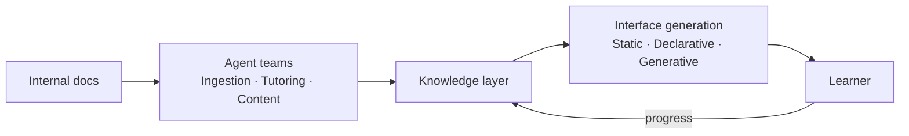

<p align="center">
  
  <h1 align="center">SkillNet</h1>
  <p align="center">
    <strong>Intelligent system for organizational knowledge evolution and talent development</strong>
  </p>
  <p align="center">
    <a href="https://skillnet.es"></a>
    <a href="https://anfaia.org"></a>
    <a href="https://skillnet-docs.vercel.app/"></a>
    
    
    
  </p>
</p>

---

> SkillNet transforms an organization's knowledge into a living intelligence system that trains, evaluates and develops talent continuously, adaptively and equitably.

## The problem

In many SMEs, critical knowledge is passed on informally, depends on specific individuals and is neither structured nor accessible. Onboarding new hires falls on the most experienced workers, who have to balance their daily workload with training, without the right tools or enough time to do it properly.

The result: **overloaded professionals** repeating the same onboarding processes over and over, directly limiting the company's ability to grow.

## The idea

Moving from static documents to a **living knowledge system**.

A system that doesn't just store information, but understands it, teaches it, adapts it and evolves with the people.

SkillNet takes a company's internal knowledge · manuals, processes, documentation · and turns it into a learning ecosystem: it automatically generates courses, handbooks, exercises and other training formats, guides users through AI agents and tracks their progress to deliver a personalized experience.

## What sets it apart

- **Living knowledge** · The system learns from usage, improves content and evolves with the company
- **Adaptive** · Content and pace tailored to each individual
- **Accessible** · Designed for any user profile, including neurodiversity
- **One product, two modes** · The same core serves an organization (company, team, class, academy) or a single individual who installs it for themselves — chosen at first boot, no forks. See [`docs/design/audience-modes.md`](docs/design/audience-modes.md)

## How it works



## Didact: a component library for learning

Generating a lesson as a web page is only half the problem. The other half is *what the page is
made of*. A tutorial site can reach for a component library — buttons, cards, tables — but there
was no equivalent for **teaching**: no off-the-shelf library of interactive learning primitives
with the contracts that pedagogy actually needs. A flashcard is not a card; a quiz is not a form;
a worked example that reveals itself step by step, a hotspot on a diagram, a drag-to-order task,
a rubric backed by a real scorer — none of these ship in a UI kit.

So SkillNet built its own: **Didact**, a catalogue of accessible, interactive learning
components with explicit educational identity. Each component declares what it teaches or checks,
which host capabilities it needs (evaluation, persistence, progress, assets…) and whether it may
certify mastery. The runtime treats it as a library, not a black box: components are pinned by a
content hash, exposed to the model through a strict boundary, and validated on the way out.

How the runtime composes them:

- **The kit and the boundary** — a frozen UI Kit is the source of truth for validation (exact
  props, closed enums, positional order). The generator only ever sees a small, closed slice of
  the catalogue, and every emitted screen is validated against the kit before it is served.
- **OpenUI** — lessons are generated as a declarative component tree (a root `Stack` whose direct
  children are the paged screens), not as free-form HTML. The model picks *from the catalogue*; it
  cannot invent a component or smuggle answers into the page.
- **The broker** — grounded, per-node capabilities (a ready podcast or infographic that matches
  the learner's modality) are injected as an addendum that *widens* what may be emitted without
  weakening validation.
- **LearningExperience** — a neutral, versioned reference that lets a server-owned interactive
  experience appear in a lesson without exposing its provider, its private definition, or its
  answers.

The catalogue, what is live, what is blocked, and what is still missing are documented in
[`docs/design/didact-components.md`](docs/design/didact-components.md); the integration and the
neutral target architecture in [`docs/design/didact-integration.md`](docs/design/didact-integration.md)
and [`docs/design/learning-experience-architecture.md`](docs/design/learning-experience-architecture.md);
adding a new component in [`docs/design/extensibility.md`](docs/design/extensibility.md).

## What's being explored

The project is in its research phase. These are the areas currently under investigation and how they connect to SkillNet:

| Area | Why it matters for SkillNet | Status |
|------|----------------------------|--------|
| **[Semantic Boundaries](docs/research/semantic-boundaries/)** | How to control who accesses what knowledge in a multi-tenant training platform | Content-only classification hits a hard ceiling. Exploring structural access control. |
| **[Generative UI](docs/research/generative-ui/)** | Personalized training content needs interfaces generated on the fly for each learner | Built A2TL-Web for Level 2 generation. Exploring Level 3 and latency solutions. |
| **[Multi-Agent Coordination](docs/research/multi-agent-coordination/)** | A platform with multiple agents serving multiple users needs governance | Discovered mandate-based authority model. Defining protocols. |
| **[Post-Markdown](docs/research/post-markdown/)** | Agents need to consume documentation efficiently to generate training content | Built mcp-md-reader (90% token savings). Exploring what comes after Markdown. |

See [`docs/research/`](docs/research/) for detailed write-ups on each topic.

## Repository structure

```
skillnet/
├── docs/
│   ├── design/                    Architecture and technical decisions
│   └── research/                  Investigation by topic
├── apps/
│   ├── skillnet-api/              FastAPI backend — auth, CRUD, RAG, LangGraph generation, chat
│   └── skillnet-web/              React SPA frontend
├── docker/                        Dockerfiles + nginx config
├── docker-compose.yml             Production stack (db + api + web)
├── packages/
│   ├── a2tl-video/                A2TL-Video — compact spec for agent-generated video
│   ├── a2tl-web/                  A2TL-Web — compact spec for agent-generated web pages
│   └── mcp-md-reader/             Intelligent markdown reading for LLM agents
└── assets/
```

## Tech stack

<p>
  
  
  
  
  
  
</p>

| Layer | Technology |
|-------|------------|
| **Intelligence** | LLMs for generation and reasoning |
| **Knowledge** | RAG grounded in reliable internal knowledge |
| **Orchestration** | Specialized AI agents with modular architecture |
| **Infrastructure** | Self-hostable, no vendor lock-in |

## Quick start

**→ [`RUNNING.md`](RUNNING.md)**

Five steps and one decision: an API key, a local model, or neither. It covers what to put in
`.env`, how to load the demo data, how to verify it came up, and what each failure symptom
means.

The short version, if you already have an OpenAI key:

```bash
cp .env.example .env                                         # then set SECRET_KEY,
                                                             # POSTGRES_PASSWORD, LLM_API_KEY
docker compose up -d --build
docker compose exec api uv run python -m src.seed_learning_demo   # optional: loads the public demo
```

Then <http://localhost:3000>, as `admin@skillnet.dev` / `admin123`. For your own install,
leave `ADMIN_EMAIL`/`ADMIN_PASSWORD` blank in `.env` and the first visit opens a `/setup`
wizard to pick the mode and create your owner account — see [`RUNNING.md`](RUNNING.md).

### Try Gen UI (dynamic courses)

Gen UI generates each learning screen on the fly, personalized for the learner.
Both static (v1) and dynamic (v2) courses are always available — the choice is per-course.

1. Run [step 4](#step-4--load-the-demo-data-recommended) if you have not already
2. Log in as a learner (password: `aprender2026`), e.g. `ana@skillnet.dev`
3. Go to **Mis Cursos** and open the showcase course, *Cómo aprende tu cerebro*

The public demo (`src.seed_learning_demo`) is on the meta theme of **how we learn**: four
short, Brilliant-style courses generated and validated at seed time, plus three demo learners
with different declared styles — `ana@` (metaphors + audio, sees the in-lesson podcast),
`bruno@` (definitions-first + visual, sees the infographic) and `carla@` (no profile, to walk
the onboarding wizard). All three share the password `aprender2026`; the admin keeps whatever
is in your `.env`. The showcase course carries a podcast and an infographic per node so the
in-lesson media components appear.

It is idempotent and re-runnable: it reuses an already-validated course of the same title and
cleans up any leftover data from the retired bakery-café demo on dev databases that still
carry it. See [`RUNNING.md`](RUNNING.md) and
[`docs/design/onboarding.md`](docs/design/onboarding.md).

### Dynamic courses (v2)

v2 generates each screen for each learner at the moment they open it, instead of serving one
static Markdown lesson to everybody. Both modes are always available — the choice is
per-course via `delivery_mode`. A course takes the v2 path only when it has
`delivery_mode='dynamic'` **and** `schema_status='validated'`; every other course stays on v1.

**No API key?** Put these two lines in your `.env` and start the stack normally:

```
LLM_MODEL=fixture/local
EMBEDDING_MODEL=fixture/local
```

Every LLM and embedding call is then served from the recordings in
`apps/skillnet-api/src/llm/fixture_data`, and the whole stack — SPA included — runs without
a single key. Two honest limits: only the screens with a recorded response render (the rest
raise a clear "fixture missing" error naming the key it wanted), and an `llm_model` saved in
the organization's settings takes priority over the environment, so a previously configured
organization keeps calling its provider.

There is also a `fixtures` profile, but it is **not** the keyless mode for the web app:

```bash
docker compose --profile fixtures up -d db api-fixtures   # http://127.0.0.1:8001
```

It publishes a second API for `curl` and Swagger. The SPA cannot use it, because
`docker/nginx.conf` proxies to `api` unconditionally with no variable to change. It also
shares `SECRET_KEY` and the database with the real API, so treat it as a debugging tool and
not as an isolated sandbox.

It runs the same image as `api` on its own port (`API_FIXTURES_PORT`, default `8001`),
because the bundled nginx SPA proxies to `api`. To run the *whole* stack keyless instead,
set `LLM_MODEL=fixture/local` and `EMBEDDING_MODEL=fixture/local` in `.env`.

Two optional knobs pick the models for the two-tier runtime router,
`LLM_RUNTIME_FAST_MODEL` and `LLM_RUNTIME_HEAVY_MODEL`. Leave both empty and every tier
falls back to `LLM_MODEL`, which works fine. Tuning generation quality is documented in
[`docs/design/tuning.md`](docs/design/tuning.md); the full design is in
[`docs/design/v2-dynamic-courses.md`](docs/design/v2-dynamic-courses.md).

## Audio, images and the render cache

SkillNet leans on a few **external API keys** for its richest output. The app runs without
them, but specific features degrade in specific ways — and because most media is generated
**at seed time** and stored, the audio and images a learner sees depend on the keys of
whoever ran the seed, not on the learner's own session.

### What each key controls, and what happens without it

| Key (`.env`) | Powers | Missing / no credits → |
|---|---|---|
| `LLM_API_KEY` (+ `LLM_MODEL`) | All content generation: courses, knowledge packs, per-lesson renders, podcast scripts | Generation cannot run at all. Use the [keyless fixtures mode](#dynamic-courses-v2) (`LLM_MODEL=fixture/local`) to explore without a key. |
| `TTS_PROVIDER` + `TTS_API_KEY` (ElevenLabs) | The mascot's live read-aloud voice, and the primary (natural, two-host) podcast voice | Two different behaviours — see below. |
| `OPENROUTER_API_KEY` | The infographic **poster image** (`openrouter/google/gemini-2.5-flash-image`) | Image generation is best-effort: the infographic degrades to its text/data sheet with **no poster image** (`has_image=false`), the job does **not** fail. |

TTS is **disabled by default** (`TTS_PROVIDER=disabled`). Two things degrade differently when
ElevenLabs has no key or no credits:

- **The mascot's live voice** — `POST /api/v1/tts/synthesize` — **hard-fails with a 500 and
  does *not* fall back to the offline voice.** This is a known gap. The frontend already
  swallows the error silently (the bubble text stays, no error is shown), so a learner just
  gets no audio rather than a broken screen.
- **Podcast generation** falls back through a provider chain (ElevenLabs → Azure, if
  configured → **offline eSpeak NG**), so a podcast is always produced — but on the offline
  path it is a robotic, non-broadcast voice.

### Media is baked at seed time and shared by everyone

Podcasts, infographics and other artefacts are generated **when the seed runs** and stored on
disk, content-addressed (`data/media_assets`). Learners opening an already-seeded database
hear and see **whatever voice and images were generated then** — media is *not* regenerated
per learner. So the quality of the audio in a demo is exactly the quality of the TTS key that
was configured at seed time.

### Why a lesson may briefly load the first time

Lessons ("episodes") are **rendered per learner** and cached under a key that includes the
learner's learning-note and media preferences, so each learner/persona gets a distinct cached
render (`src/services/node_render_service.py`). The seed **pre-warms** the first couple of
lessons into the shared cache so learners do not wait. If a lesson is not pre-warmed for that
learner's key, the first open **regenerates on demand** — a short "Preparándose…" wait.
Generation is stochastic (DeepSeek et al.), so a lesson can occasionally come back as a flat
fallback version. Bumping a course's `schema_version` (e.g. `--refresh`) or deleting cached
renders forces regeneration.

For the design-level detail see [`docs/design/media-artifacts.md`](docs/design/media-artifacts.md)
§5, [`docs/design/personalization.md`](docs/design/personalization.md), and the in-app
degraded-mode plan in [`docs/design/degraded-mode-ux.md`](docs/design/degraded-mode-ux.md).

## Services and ports

**A default `docker compose up -d` publishes exactly one port: 3000.** Everything else
talks over the internal compose network, so the API and the database are not reachable from
your machine, let alone from the network — which is the point.

| Service | Published | Reachable from | Description |
|---------|-----------|----------------|-------------|
| **web** | `3000` | anywhere on your network | SPA + nginx, the only front door |
| **api** | — | inside compose only | FastAPI, behind nginx |
| **db** | — | inside compose only | PostgreSQL + pgvector |
| **api-fixtures** *(profile `fixtures`)* | `127.0.0.1:8001` | this machine only | keyless API for `curl`, **not** used by the SPA |
| **a2a** *(profile `a2a`)* | `127.0.0.1:5000` | this machine only | agent-to-agent server; refuses to start without `A2A_AUTH_KEY` |
| **ollama** *(overlay file)* | `127.0.0.1:11434` | this machine only | local model server |

The development overlay adds two more, both bound to `127.0.0.1`: `8000` for the API
(bypassing nginx, so no security headers and no upload limit) and `5432` for Postgres.
Never change those to `0.0.0.0` on a shared network: Docker publishes ports with DNAT rules
that **bypass the host firewall**, so a firewall will not save you.

`web` on `3000` is deliberately open so other devices can reach the app. If you serve it
over plain HTTP beyond localhost, note that `COOKIE_SECURE` defaults to `false`, which means
session cookies travel unencrypted. Put it behind TLS and set `COOKIE_SECURE=true`.

### API documentation

Set `DEBUG=true` in your `.env` for Swagger at
[http://localhost:3000/api/docs](http://localhost:3000/api/docs).

A caveat worth knowing, because it bites more than `DEBUG`: **only the variables listed in
`docker-compose.yml` reach the container.** No service declares `env_file`, and
`.dockerignore` keeps `.env` out of the image, so anything you add to `.env` that the
compose file does not forward is silently ignored. That includes most of the tuning dials in
[`docs/design/tuning.md`](docs/design/tuning.md) — to use one, add it to the `environment:`
block of `api` first.

### Agent tools (a2a + external API)

The `a2a` service (profile `a2a`) exposes SkillNet to external agents over A2A JSON-RPC:
`who_knows`, `get_gap`, `verify_skill`, `list_skills`, `get_user_skills`, and — new — a
one-call **`create_course`** that builds a full dynamic course end to end (propose schema,
generate knowledge packs with retry, review, validate, optional enrol + media artefacts).
The same capability is a REST endpoint, `POST /ext/v1/courses/full` (API-key auth,
`courses:write`). All three surfaces — the a2a tool, the endpoint, and the
`scripts/create_course.py` CLI — call one orchestrator,
`src/services/course_orchestration.py::create_course_end_to_end`, which reuses the existing
authoring services rather than reimplementing generation. Full reference (auth, inputs,
outputs, examples): [`docs/design/mcp-external-api.md`](docs/design/mcp-external-api.md) §8.1.2 and §8.9.

```bash
# Create a fully-validated course in one command (runs inside the api container):
docker compose exec -T api sh -c \
  'cd /app && uv run python scripts/create_course.py "Food safety basics"'
```

### Local development

```bash
# Backend (needs a reachable PostgreSQL+pgvector, e.g. `docker compose up -d db`)
cd apps/skillnet-api
uv sync
uv run uvicorn src.main:app --reload      # http://localhost:8000  (docs at /api/docs in DEBUG)
uv run pytest -m "not integration"        # unit tests — no database, no API key
uv run pytest -m integration              # integration suites — need a live PostgreSQL
uv run ruff check src tests

# Generation quality bench (see docs/design/tuning.md)
uv run python scripts/quality_bench.py --offline   # recorded fixtures, no API key

# Frontend (Vite dev server proxies /api to localhost:8000)
cd apps/skillnet-web
pnpm install
pnpm dev                                   # http://localhost:5173
```

### End-to-end flow

Admin uploads a document — creates a course from it — triggers generation (the
LangGraph pipeline extracts themes, designs structure, writes modules/lessons in
Markdown and exercises, self-reviews, and publishes a draft) — publishes the
course — invites an employee and assigns the course. The employee logs in, works
through the Markdown lessons and exercises, and asks the tutor chatbot questions
answered from the source material via RAG.

## Ethics

- **Data sovereignty** · User metrics are encrypted and belong to the employee and the organization, not to an external SaaS
- **Equal access** · Democratizing knowledge within organizations
- **Bias reduction** · Objective, data-driven assessment instead of perception-based evaluation
- **SDGs** · Aligned with SDG 4 (quality education) and SDG 8 (decent work)

## License

Distributed under the [Apache 2.0](LICENSE) license.

---

<p align="center">
  <em>Early-stage project. Architecture, stack and scope may evolve during development.</em>
  <br><br>
  Built as part of the <a href="https://anfaia.org">ANFAIA Summer Grants 2026</a>
</p>
