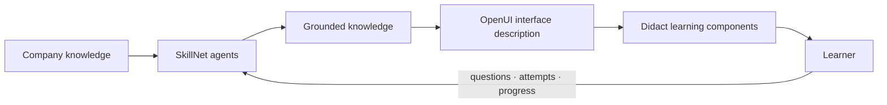

<p align="center">
  
</p>

<h1 align="center">SkillNet</h1>

<p align="center">
  <strong>SkillNet turns your documents into courses that adapt to each person: the same source of knowledge, a different experience for each learner.</strong>
</p>

<p align="center">
  <a href="https://skillnet.es">Website</a> ·
  <a href="https://skillnet.es/docs/">Documentation</a> ·
  <a href="RUNNING.md">Quick start</a> ·
  <a href="https://github.com/ANFAIA/SkillNet">GitHub</a>
</p>

SkillNet turns the documents an organization already has into courses, lessons and exercises. Each
learner can move through that material differently while staying connected to the same source of
knowledge.

It is an open-source, self-hosted project.

**[Start here: run SkillNet locally →](RUNNING.md)**

## From documents to courses

Most organizations already have the material they need to teach something: manuals, processes,
policies, recordings or the knowledge of someone who does the work. The difficult part is turning
that material into something a person can learn from.

SkillNet builds that path:

```text
company documents
        → structured knowledge
        → course and lesson generation
        → exercises, explanations and practice
        → a learning experience for each learner
```

The same source can support a course, a reference manual, an exercise or a tutor conversation. The
content is connected to the material it came from instead of being created as a separate artifact.

## The same source, a different experience

The knowledge and objectives can remain stable while the parts around them change for the person
learning:

| The source stays stable | The experience can change |
| --- | --- |
| facts, objectives, evidence and criteria | route, explanation, example, practice, interface and pace |

The source stays shared. The route, explanation, example, practice, interface and pace can change
for each learner.

## How it works



SkillNet combines a knowledge layer, specialised agents and learning surfaces. The current
generated-interface path uses [OpenUI](https://github.com/openai/openui). [Didact](https://github.com/JoseEstevez520/Didact)
provides the educational components: flashcards, worked examples, diagrams, practice activities and
other interactions designed for learning.

## What is available

- Upload and process organisational documents.
- Generate courses, lessons and exercises from that knowledge.
- Support static and dynamic course paths.
- Ask questions grounded in course material.
- Record learning activity, attempts and progress.
- Run the system locally or self-host it with Docker.

The project is still in development. Some adaptive directions are documented and being tested, but
they should not be read as promises about learning outcomes or as a claim that the system already
knows how every person learns.

## Ecosystem

SkillNet is the main project. The surrounding repositories explore parts of the same direction:

- [Didact](https://github.com/JoseEstevez520/Didact) — educational components used by SkillNet.
- [OpenUI](https://github.com/openai/openui) — the current generated-interface layer.
- [mcp-md-reader](https://github.com/JoseEstevez520/mcp-md-reader) — structural Markdown reading for agent workflows.
- [A2TL-Web](https://github.com/JoseEstevez520/a2tl-web) — earlier research into compact generated interfaces.
- [A2TL-Video](https://github.com/JoseEstevez520/a2tl-video) — related work for agent-generated video.
- [Curio](https://github.com/JoseEstevez520/curio) — contextual reading and explanation research.
- [DBP](https://github.com/JoseEstevez520/DBP) — related work on data boundaries between agents.

These projects are related at different levels. They are not all dependencies of the current
SkillNet runtime.

## Start here

The complete [running guide](RUNNING.md) covers setup, demo data, configuration, keyless fixtures
and troubleshooting.

```bash
cp .env.example .env
docker compose up -d --build
docker compose exec api uv run python -m src.seed_learning_demo
```

Then open <http://localhost:3000>. The repository also includes a keyless fixture mode for local
experiments; see [`RUNNING.md`](RUNNING.md) for the available options.

## Explore the project

- [`docs/design/vision.md`](docs/design/vision.md) — the ideas behind the product.
- [`docs/design/product.md`](docs/design/product.md) — current scope and product direction.
- [`docs/design/openui-adoption.md`](docs/design/openui-adoption.md) — how generated interfaces are evaluated and integrated.
- [`docs/design/didact-integration.md`](docs/design/didact-integration.md) — how Didact components enter SkillNet.
- [`docs/research/generative-ui/`](docs/research/generative-ui/) — experiments with generated interfaces.
- [`docs/research/post-markdown/`](docs/research/post-markdown/) — how agents read existing documentation.

## License

Distributed under the [Apache 2.0](LICENSE) license.
