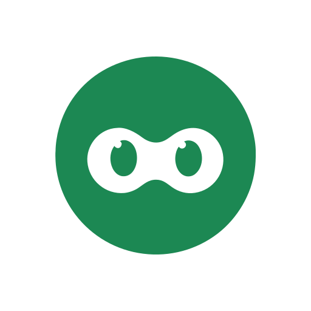
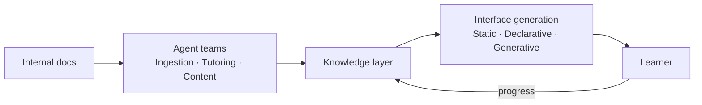

<p align="center">
  
  <h1 align="center">SkillNet</h1>
  <p align="center">
    <strong>Intelligent system for organizational knowledge evolution and talent development</strong>
  </p>
  <p align="center">
    <a href="https://anfaia.org"></a>
    <a href="https://skillnet-docs.vercel.app/"></a>
    
    
    
  </p>
</p>

---

> SkillNet transforms an organization's knowledge into a living intelligence system that trains, evaluates and develops talent continuously, adaptively and equitably.

## The problem

In many SMEs, critical knowledge is passed on informally, depends on specific individuals and is neither structured nor accessible. Onboarding new hires falls on the most experienced workers, who have to balance their daily workload with training, without the right tools or enough time to do it properly.

The result: **overloaded professionals** repeating the same onboarding processes over and over, directly limiting the company's ability to grow.

## The idea

Moving from static documents to a **living knowledge system**.

A system that doesn't just store information, but understands it, teaches it, adapts it and evolves with the people.

SkillNet takes a company's internal knowledge · manuals, processes, documentation · and turns it into a learning ecosystem: it automatically generates courses, handbooks, exercises and other training formats, guides users through AI agents and tracks their progress to deliver a personalized experience.

## What sets it apart

- **Living knowledge** · The system learns from usage, improves content and evolves with the company
- **Adaptive** · Content and pace tailored to each individual
- **Accessible** · Designed for any user profile, including neurodiversity

## How it works



## What's being explored

The project is in its research phase. These are the areas currently under investigation and how they connect to SkillNet:

| Area | Why it matters for SkillNet | Status |
|------|----------------------------|--------|
| **[Semantic Boundaries](docs/research/semantic-boundaries/)** | How to control who accesses what knowledge in a multi-tenant training platform | Content-only classification hits a hard ceiling. Exploring structural access control. |
| **[Generative UI](docs/research/generative-ui/)** | Personalized training content needs interfaces generated on the fly for each learner | Built UIDL for Level 2 generation. Exploring Level 3 and latency solutions. |
| **[Multi-Agent Coordination](docs/research/multi-agent-coordination/)** | A platform with multiple agents serving multiple users needs governance | Discovered mandate-based authority model. Defining protocols. |
| **[Post-Markdown](docs/research/post-markdown/)** | Agents need to consume documentation efficiently to generate training content | Built mcp-md-reader (90% token savings). Exploring what comes after Markdown. |

See [`docs/research/`](docs/research/) for detailed write-ups on each topic.

## Repository structure

```
skillnet/
├── docs/
│   ├── design/                    Architecture and technical decisions
│   └── research/                  Investigation by topic
├── apps/
│   └── skillnet-web/              Main application (in development)
├── packages/
│   ├── mcp-md-reader/             Intelligent markdown reading for LLM agents
│   └── mcp-ui-renderer/           Compact DSL for generating standalone HTML pages
└── assets/
```

## Tech stack

<p>
  
  
  
  
  
  
</p>

| Layer | Technology |
|-------|------------|
| **Intelligence** | LLMs for generation and reasoning |
| **Knowledge** | RAG grounded in reliable internal knowledge |
| **Orchestration** | Specialized AI agents with modular architecture |
| **Infrastructure** | Self-hostable, no vendor lock-in |

## Quick start

```bash
# Frontend (React dashboard with mock data)
cd apps/skillnet-web
npm install
npm run dev
```

## Ethics

- **Data sovereignty** · User metrics are encrypted and belong to the employee and the organization, not to an external SaaS
- **Equal access** · Democratizing knowledge within organizations
- **Bias reduction** · Objective, data-driven assessment instead of perception-based evaluation
- **SDGs** · Aligned with SDG 4 (quality education) and SDG 8 (decent work)

## License

Distributed under the [Apache 2.0](LICENSE) license.

---

<p align="center">
  <em>Early-stage project. Architecture, stack and scope may evolve during development.</em>
  <br><br>
  Built as part of the <a href="https://anfaia.org">ANFAIA Summer Grants 2026</a>
</p>
