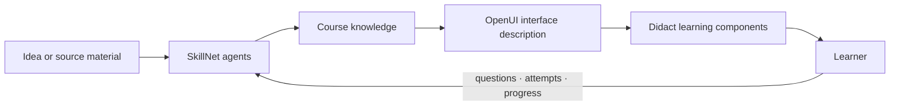

<p align="center">
  
</p>

<h1 align="center">SkillNet</h1>

<p align="center">
  <strong>SkillNet turns an idea or source into a course whose explanations, activities and interface can adapt to each person.</strong>
</p>

<p align="center">
  <a href="https://skillnet.es">Website</a> ·
  <a href="https://skillnet.es/docs/">Documentation</a> ·
  <a href="RUNNING.md">Quick start</a> ·
  <a href="https://github.com/ANFAIA/SkillNet">GitHub</a>
</p>

SkillNet is an open-source adaptive learning system. Start with a topic or existing material and it
builds a structured course that can present the same knowledge differently to each learner.

It can run as a shared space for an organization or class, or as an individual learning workspace.
It is self-hosted and licensed under Apache 2.0.

**[Start here: run SkillNet locally →](RUNNING.md)**

## From ideas and sources to courses

You can begin by describing what you want to teach or learn, or by uploading the material that
already contains that knowledge. SkillNet turns it into a course. Uploaded material remains the
grounding source; when you start from an idea, SkillNet creates a generated source, records that
provenance and builds the course from it.

SkillNet builds that path:

```text
idea or source material
        → structured course knowledge
        → course and lesson generation
        → exercises, explanations and practice
        → a learning experience for each learner
```

The result is not limited to a single fixed presentation. The same course can support different
explanations, activities, media and interfaces while preserving its knowledge and objectives.

## The same knowledge and objective, a different experience

The knowledge and objectives can remain stable while the parts around them change for the person
learning:

| What stays stable | What can change |
| --- | --- |
| knowledge, objectives, evidence and criteria | explanation, example, activity, support and interface |

In a dynamic course, the shared knowledge and objectives stay stable while the explanation,
activity, support and interface can adapt using the learner's declared preferences, role, level and
progress. These signals shape the experience without being treated as fixed learning styles.

## How it works



SkillNet combines a knowledge layer, specialised agents and learning surfaces. The current
generated-interface path uses [OpenUI](https://github.com/thesysdev/openui). [Didact](https://github.com/JoseEstevez520/Didact)
provides the educational components: flashcards, worked examples, diagrams, practice activities and
other interactions designed for learning.

## What is available

- Create a course from a topic or from PDF, DOCX, Markdown or TXT material.
- Generate its structure, lessons and exercises.
- Support static and dynamic course paths.
- Ask questions grounded in course material.
- Record learning activity, attempts and progress.
- Choose an organization or individual workspace at first setup.
- Create a complete course through the UI, external API, A2A service or MCP server.
- Run the system locally or self-host it with Docker.

The project is still in development. Some adaptive directions are documented and being tested, but
they should not be read as promises about learning outcomes or as a claim that the system already
knows how every person learns.

## Ecosystem

SkillNet is the main project. The surrounding repositories explore parts of the same direction:

- [Didact](https://github.com/JoseEstevez520/Didact) — educational components used by SkillNet.
- [OpenUI](https://github.com/thesysdev/openui) — the current generated-interface layer.
- [mcp-md-reader](https://github.com/JoseEstevez520/mcp-md-reader) — structural Markdown reading for agent workflows.
- [SkillNet MCP](packages/skillnet-mcp/) — use SkillNet from MCP-compatible chats and agents.
- [A2TL-Web](https://github.com/JoseEstevez520/a2tl-web) — earlier research into compact generated interfaces.
- [A2TL-Video](https://github.com/JoseEstevez520/a2tl-video) — related work for agent-generated video.
- [Curio](https://github.com/JoseEstevez520/curio) — contextual reading and explanation research.
- [DBP](https://github.com/JoseEstevez520/DBP) — related work on data boundaries between agents.

These projects are related at different levels. They are not all dependencies of the current
SkillNet runtime.

## Start here

The complete [running guide](RUNNING.md) covers setup, demo data, configuration, keyless fixtures
and troubleshooting.

```bash
cp .env.example .env                      # set the two secrets, then choose API, local model or fixtures
docker compose up -d --build
docker compose exec api uv run python -m src.seed_learning_demo   # optional: loads the public demo
```

Then open <http://localhost:3000>. The repository also includes a keyless fixture mode for local
experiments; see [`RUNNING.md`](RUNNING.md) for the available options.

## Explore the project

- [`docs/design/vision.md`](docs/design/vision.md) — the ideas behind the product.
- [`docs/design/product.md`](docs/design/product.md) — current scope and product direction.
- [`docs/design/openui-adoption.md`](docs/design/openui-adoption.md) — how generated interfaces are evaluated and integrated.
- [`docs/design/didact-integration.md`](docs/design/didact-integration.md) — how Didact components enter SkillNet.
- [`docs/research/generative-ui/`](docs/research/generative-ui/) — experiments with generated interfaces.
- [`docs/research/post-markdown/`](docs/research/post-markdown/) — how agents read existing documentation.

## License

Distributed under the [Apache 2.0](LICENSE) license.
